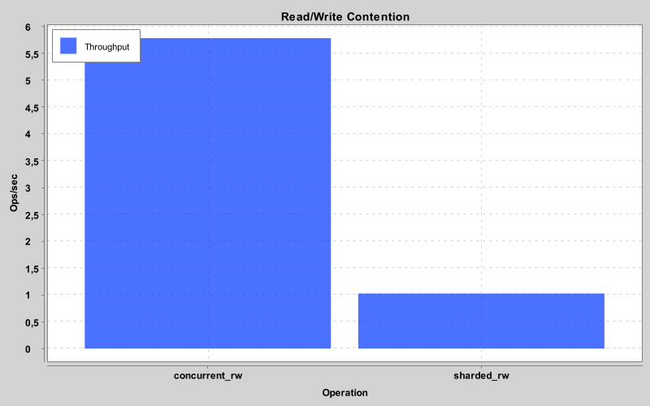
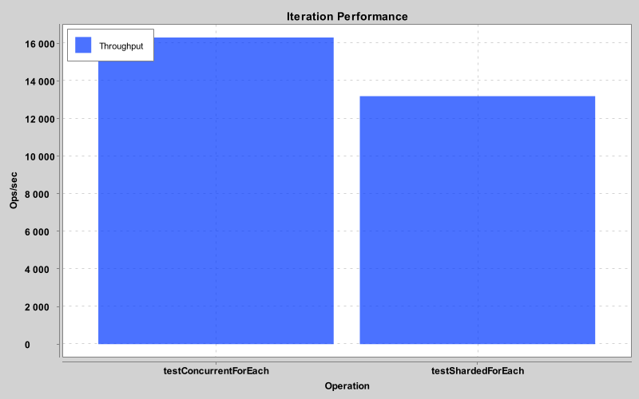

# ShardedMap

[](https://www.codefactor.io/repository/github/mrlarkyy/shardedmap)
[](https://repo.nekroplex.com/#/releases/gg/aquatic/shardedmap)

[](https://discord.com/invite/ffKAAQwNdC)

A high-performance, thread-safe sharded map implementation for Kotlin/JVM. 

`ShardedMap` reduces lock contention by splitting the dataset into multiple independent segments (shards), each with its own lock. This allows multiple threads to perform operations on different parts of the map simultaneously.

## Features

- **Low Contention:** Optimized for multi-threaded environments where a single global lock would be a bottleneck.
- **Cache Optimized:** Internal segments use manual padding to prevent "False Sharing" on CPU cache lines.
- **No-Allocation Iteration:** `forEach` provides weakly-consistent iteration across all shards without creating snapshots or temporary objects.
- **Power-of-Two Sharding:** Uses bitwise masking for ultra-fast shard lookup.

## Performance Benchmarks

Below are the throughput results (Operations per Second) comparing `ShardedMap` (256 shards) against Java's `ConcurrentHashMap`.

### 1. Read/Write Contention
*Measured with 4 threads reading and 1 thread writing simultaneously.*



### 2. Iteration Performance
*Measured by calculating the sum of values across the entire map.*



## Usage

### Installation
Add the library to your project (Update with your specific coordinates):
```kotlin
repositories {
    maven("https://repo.nekroplex.com/releases")
}

dependencies {
    implementation("gg.aquatic:shardedmap:26.0.1")
}
```

### Basic Example
```kotlin
val map = ShardedMap<String, Int>()

// Set and Get
map["Apple"] = 10
val count = map["Apple"]

// Thread-safe iteration
map.forEach { key, value ->
    println("$key -> $value")
}

// Remove
map -= "Apple"
```

---

## 💬 Community & Support

Got questions, need help, or want to showcase what you've built with **ShardedMap**? Join our community!

[](https://discord.com/invite/ffKAAQwNdC)

*   **Discord**: [Join the Aquatic Development Discord](https://discord.com/invite/ffKAAQwNdC)
*   **Issues**: Open a ticket on GitHub for bugs or feature requests.